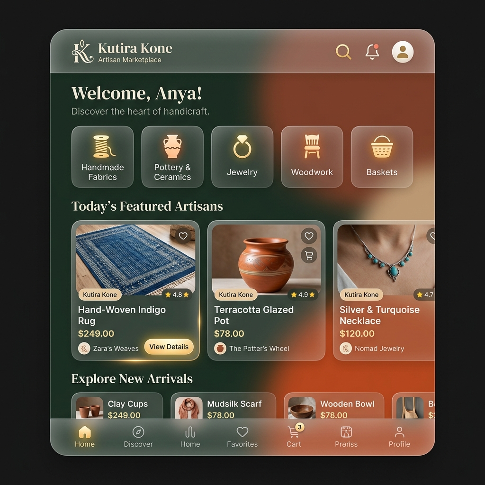
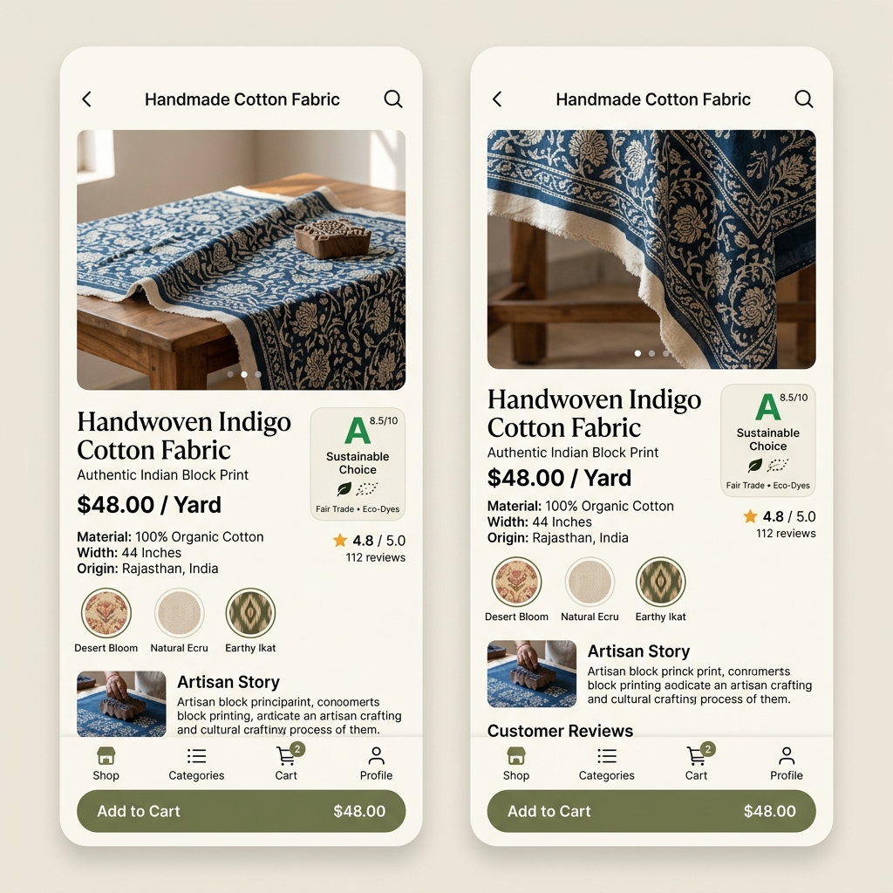

# 🌿 Kutira Kone - Zero-Waste Fabric Exchange

## 📖 Overview
**Kutira Kone** is a revolutionary sustainable marketplace designed to connect artisans, tailors, and eco-conscious crafters. The name **Kutira** (Cottage/Hut) represents the grassroots spirit of cottage industries, while **Kone** signifies connection. 

Our mission is to minimize textile waste by facilitating a **Zero-Waste Fabric Exchange**, where surplus materials find new life in the hands of creative artisans.

---

## 🚀 Vision
To build a circular economy for the textile industry, reducing landfill waste and empowering local creators through a transparent, high-trust digital marketplace.

## ? Key Features
- **Artisan Marketplace**: Buy and sell handcrafted products made from recycled materials.
- **Tailor Connection**: Connect with expert tailors to upcycle your surplus fabrics.
- **Sustainability Tracking**: Real-time impact dashboard showing waste reduction metrics.
- **Community Chat**: Direct communication between sellers, buyers, and service providers.
- **Project Ideas Hub**: Discover creative ways to use small fabric scraps.
- **Geo-Location Search**: Find local artisans and tailors near you to reduce logistics footprint.

