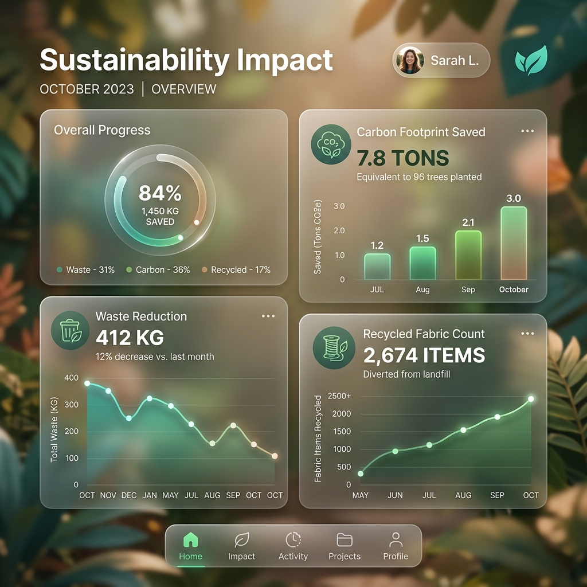

# 🌿 Kutira Kone - Zero-Waste Fabric Exchange


## 📖 Overview
**Kutira Kone** is a revolutionary sustainable marketplace designed to connect artisans, tailors, and eco-conscious crafters. The name **Kutira** (Cottage/Hut) represents the grassroots spirit of cottage industries, while **Kone** signifies connection. 

Our mission is to minimize textile waste by facilitating a **Zero-Waste Fabric Exchange**, where surplus materials find new life in the hands of creative artisans.

---

## 🚀 Vision
To build a circular economy for the textile industry, reducing landfill waste and empowering local creators through a transparent, high-trust digital marketplace.


## ? Key Features
- **Artisan Marketplace**: Buy and sell handcrafted products made from recycled materials.
- **Tailor Connection**: Connect with expert tailors to upcycle your surplus fabrics.
- **Sustainability Tracking**: Real-time impact dashboard showing waste reduction metrics.
- **Community Chat**: Direct communication between sellers, buyers, and service providers.
- **Project Ideas Hub**: Discover creative ways to use small fabric scraps.
- **Geo-Location Search**: Find local artisans and tailors near you to reduce logistics footprint.


## ?? Tech Stack
- **Frontend**: Flutter (Mobile, Web, Desktop)
- **State Management**: Provider
- **Backend**: Firebase (Authentication, Cloud Firestore)
- **Navigation**: GoRouter
- **Design System**: Custom Theme with Google Fonts
- **Assets**: Font Awesome, Custom Vector Illustrations

---

## ?? Project Structure
```text
lib/
+-- models/         # Data structures and models
+-- screens/        # Full-page UI screens
¦   +-- artisan/    # Artisan-specific dashboards
¦   +-- tailor/     # Tailor-specific modules
+-- services/       # API and Backend logic (Firebase)
+-- theme/          # Custom branding and design tokens
+-- utils/          # Helper functions and utilities
+-- widgets/        # Reusable UI components
```


## ?? Installation & Setup

### Prerequisites
- [Flutter SDK](https://docs.flutter.dev/get-started/install) (v3.10+)
- [Dart SDK](https://dart.dev/get-dart)
- Firebase Account (for backend services)

### Setup Steps
1. **Clone the repository:**
   ```bash
   git clone https://github.com/Mohammadzayd25/Kutira-kone.git
   ```
2. **Navigate to project folder:**
   ```bash
   cd Kutira-kone
   ```
3. **Install dependencies:**
   ```bash
   flutter pub get
   ```
4. **Configure Firebase:**
   - Create a project on [Firebase Console](https://console.firebase.google.com/).
   - Add Android/iOS apps and download `google-services.json` / `GoogleService-Info.plist`.
   - Place them in the respective `android/app` and `ios/Runner` folders.
5. **Run the app:**
   ```bash
   flutter run
   ```

---

## ?? Impact Analysis
Our integrated sustainability dashboard helps users track their environmental contribution.




## ?? Roadmap
- [ ] **AI-Based Fabric Detection**: Automatic categorization of fabric types from photos.
- [ ] **Blockchain Integration**: Transparent tracking of fabric origin and lifecycle.
- [ ] **Global Marketplace**: Expanding from local exchanges to international eco-shipping.

## ?? Contributing
Contributions are welcome! Please fork the repo and submit a PR.

## ?? License
This project is licensed under the MIT License - see the [LICENSE](LICENSE) file for details.

---
Created with ?? by [Mohammad Zayd](https://github.com/Mohammadzayd25)

